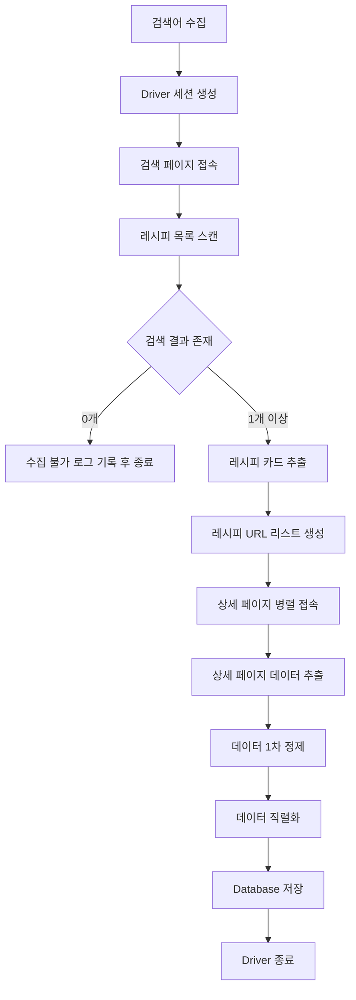
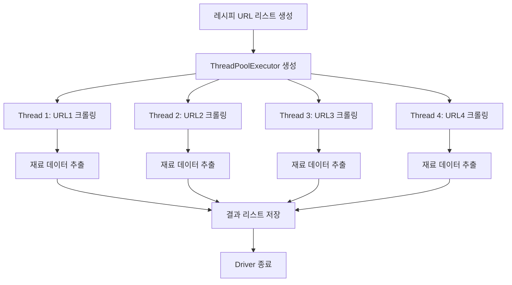
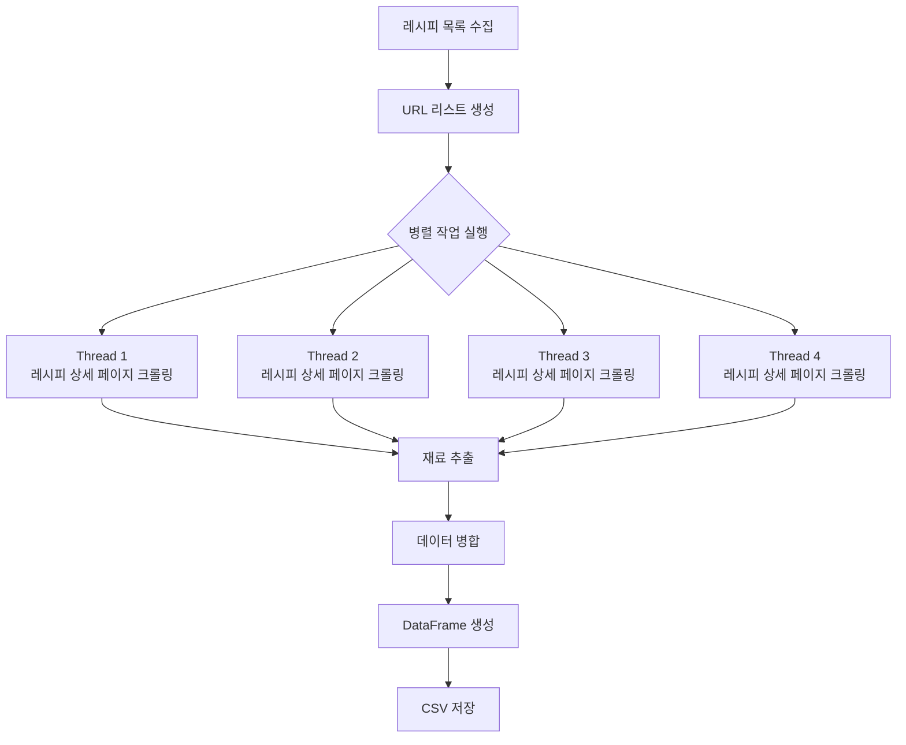
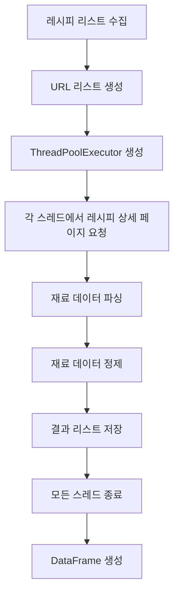
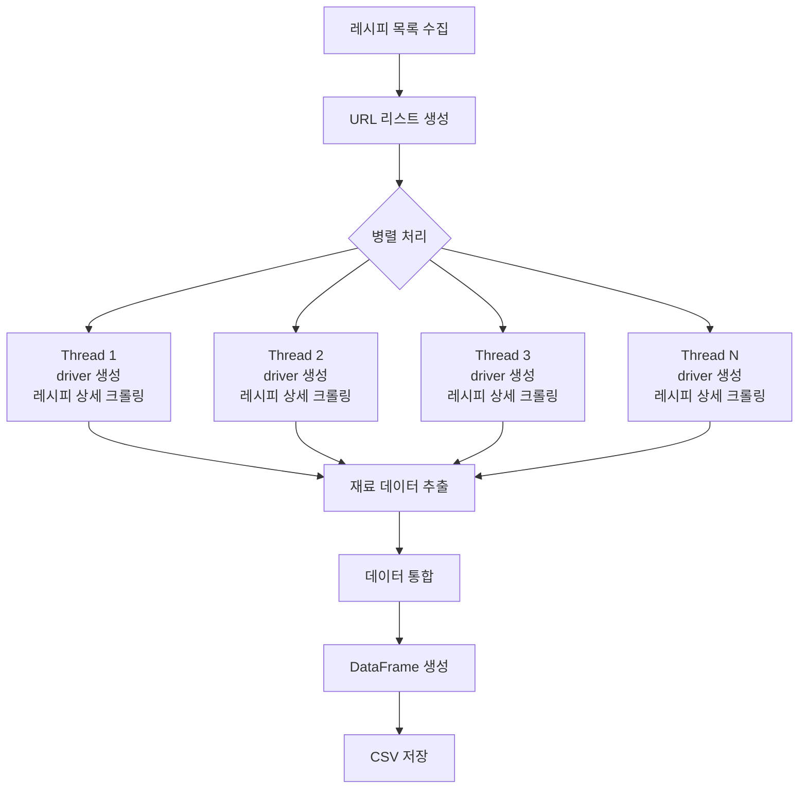

# Crawling.py 설계 문서

## 1. 개요 (Overview)

`Crawling.py` 모듈은 웹 스크래핑을 통해 레시피 웹사이트에서 **레시피 제목과 URL을 수집하고, 향후 상세 페이지에서 재료 데이터를 추출하기 위한 크롤링 모듈**이다.

사용자가 입력한 검색어를 기반으로 레시피 검색 결과 페이지에 접근하여 다음 데이터를 수집한다.

- 레시피 제목 (Recipe Title)
- 레시피 URL (Recipe URL)

수집된 URL을 기반으로 향후 상세 페이지에 접근하여 다음 데이터를 추가로 추출할 예정이다.

- 재료 목록
- 레시피 설명
- 조리 과정

---

## 2. 역할 (Responsibilities)

### Crawling.py

`Crawling.py` 모듈은 다음 기능을 수행한다.

- 사용자 입력 기반 레시피 검색
- 검색 결과 페이지에서 레시피 카드 수집
- 레시피 제목 및 URL 추출
- 상세 페이지 접근 준비
- 향후 재료 데이터 추출을 위한 기반 데이터 생성

---

## 3. 사용 기술 (Technology)

### 사용 언어
### 사용 라이브러리

| 라이브러리 | 역할 |
|---|---|
| Selenium | 동적 웹 페이지 크롤링 |
| BeautifulSoup (bs4) | HTML 파싱 |
| webdriver_manager | ChromeDriver 자동 설치 |
| time | 페이지 로딩 대기 |

---

## 4. 순서도 (개선)

본 크롤링 프로세스는 **데이터 수집 자동화와 안정적인 리소스 관리를 목표로 설계**되었다.  
검색어 기반 레시피 수집 후 병렬 처리로 상세 페이지 데이터를 가져오고 정제 후 DB에 저장한다.

---

### 크롤링 전체 흐름


### 단계 설명
#### (1) 사용자/시스템으로부터 검색어 수집 (Batch 또는 On-demand)
- 사용자 입력
- Batch 크롤링 스케줄러
- 시스템 자동 데이터 보충

#### (2) driver_loader를 통한 독립적 브라우저 세션 생성
driver_loader 모듈을 사용하여 Selenium WebDriver를 생성한다.

#### (3) 검색 결과 스캔 및 common_sp_list_li 클래스 기반 요소 추출
레시피 검색 결과 페이지에서 레시피 카드 목록을 수집한다.

#### (4) [예외처리] 결과가 0개일 경우 '수집 불가' 로그 생성 후 종료
검색 결과가 없는 경우 다음 처리를 수행한다.
- 로그 기록
- 크롤링 중단
- 다음 키워드로 이동

#### (5) 상세 페이지 병렬 접속 (ThreadPoolExecutor)
ThreadPoolExecutor를 활용하여 상세 페이지 크롤링을 병렬 처리한다.

장점
- 수집 속도 향상
- 네트워크 대기 시간 최소화

주의사항
- 각 스레드는 독립적인 driver 사용
- 작업 종료 후 반드시 quit() 수행

#### (6) 데이터 추출 및 DataCleaner를 통한 1차 정제
DataCleaner 모듈을 통해 다음 작업 수행
- 재료 단위 제거
-  불필요 텍스트 제거
- 문자열 정규화

#### (7) RecipeDataManager를 통해 리스트 -> 문자열 직렬화 및 DB 저장
RecipeDataManager 모듈에서 데이터를 직렬화하여 DB에 저장한다.

#### (8) driver.quit()을 통한 리소스 완전 해제`
모든 작업이 완료되면 Selenium Driver를 종료한다.
효과
- 메모리 누수 방지
- 크롬 프로세스 정리
- 안정적인 장기 실행 가능

## 5. 사용 URL

### 검색 페이지
    https://www.10000recipe.com/recipe/list.html?q=
    검색어를 URL 뒤에 붙여 레시피 검색 결과를 가져온다.

    예시
        https://www.10000recipe.com/recipe/list.html?q=김치

---

### 상세 페이지
    https://www.10000recipe.com
    상세 레시피 페이지는 **상대 경로(relative path)** 형태로 제공된다.
    
    예시
        /recipe/6921234
        
    따라서 Base URL과 결합하여 사용해야 한다.

    예시
        https://www.10000recipe.com/recipe/6921234


---

## 6. 주요 Selector 정보

Crawling.py는 다음 Selector를 사용하여 데이터를 수집한다.

### 레시피 개수 Selector
    #contents_area_full > ul > div > b

검색 결과의 레시피 개수를 확인하는 Selector이다.

주의사항

- 해당 Selector는 **DOM 구조에 의존**한다.
- 사이트 구조가 변경될 경우 동작하지 않을 수 있다.
- 향후 **class 기반 Selector로 개선**이 필요하다.

---

### 레시피 목록 Selector
    #contents_area_full > ul > ul > li

검색 결과 페이지에 표시된 **모든 레시피 카드 요소**를 가져온다.

---

### 재료 Selector
    #divConfirmedMaterialArea > ul:nth-child(1) > li

레시피 상세 페이지에서 **재료 목록을 추출하는 Selector**이다.

---

## 7. Technical Review 

### Selector 유연성

현재 사용된 Selector
    #contents_area_full > ul > ul > li

DOM 구조가 조금만 변경되어도 Selector가 깨질 수 있다.
만개한레시피 사이트의 경우 레시피 카드에 공통적으로 다음 클래스가 존재한다.
    common_sp_list_li

추천 방식

```python
soup.select(".common_sp_list_li")
```

### Anti-Bot 회피
Headless 모드 실행 시 서버에서 자동화 봇으로 감지할 수 있다.
이를 최소화하기 위해 다음 설정을 권장한다.
- User-Agent 설정
- 요청 간격 조절
- 랜덤 대기 시간 추가

예시
```python 
    chrome_options.add_argument(
    "User-Agent=Mozilla/5.0 (Macintosh; Intel Mac OS X)"
    )
```


### 데이터 가공 준비 (정규표현식)
    레시피 상세 페이지에서 재료 데이터를 수집할 경우 다음과 같은 형태의 데이터가 존재한다.

#### 예시
- 돼지고기 200g
- 마늘 2큰술
- 소금 약간

이 데이터를 다음 구조로 분리하는 것이 이상적이다.
[재료명, 수량, 단위]

#### 예시
[돼지고기, 200, g]
[마늘, 2, 큰술]
[소금, 약간, None]


이를 위해 정규표현식(re) 기반 파싱 모듈을 별도로 분리하는 것을 권장한다.
#### 예시 구조
Utils/
text_clean.py

---

## 8. 병렬 처리 구조 (Parallel Crawling)

기존 크롤링 방식은 **Sequential Crawling (순차 처리)** 방식이다.

이 방식은 구현이 간단하지만 다음과 같은 문제가 있다.

- 크롤링 속도가 느림
- 레시피 수가 많을 경우 처리 시간이 증가
- 네트워크 대기 시간이 길어짐

따라서 **멀티스레딩 기반 병렬 크롤링 구조**로 개선할 수 있다.

---

### 병렬 크롤링 순서도



### 병렬 처리 구현 예시
```python 
    from concurrent.futures import ThreadPoolExecutor

    with ThreadPoolExecutor(max_workers=4) as executor:
    executor.map(crawl_recipe, recipe_urls)
```


# 9. 병렬 크롤링 구조 (Parallel Crawling Architecture)

기존 Crawling.py는 **순차적(Sequential) 방식**으로 동작한다.  
즉, 하나의 레시피를 크롤링한 후 다음 레시피를 처리하는 구조이다.

하지만 레시피 수가 많아질 경우 속도가 크게 느려질 수 있기 때문에  
**병렬 처리(Parallel Crawling)** 구조로 확장할 수 있다.

병렬 처리는 Python의 `concurrent.futures.ThreadPoolExecutor`를 이용하여 구현할 수 있다.

---

## 병렬 처리 흐름


---

## 10. 병렬 크롤링 구조 (Parallel Crawling Architecture)

레시피 상세 페이지 수집 속도를 개선하기 위해 **멀티스레딩 기반 병렬 크롤링 구조**를 사용할 수 있다.  
기존 순차적 크롤링(Sequential Crawling)은 레시피 페이지를 하나씩 처리하기 때문에 속도가 느리지만,  
병렬 크롤링을 사용하면 여러 레시피 페이지를 동시에 처리할 수 있다.

### 병렬 처리 흐름



---
```python 
    from concurrent.futures import ThreadPoolExecutor

    def crawl_recipe(url):
        driver = get_headless_driver()
        driver.get(url)

        # 재료 추출 로직
        ingredients = parse_ingredients(driver)

        driver.quit()
        return ingredients


    with ThreadPoolExecutor(max_workers=4) as executor:
        results = executor.map(crawl_recipe, recipe_urls)
```

---

## 11. 병렬 크롤링 구조 (Parallel Crawling Architecture)

대량의 레시피 상세 페이지를 수집할 경우 순차적으로 처리하면 시간이 매우 오래 걸린다.  
따라서 **멀티스레딩 기반 병렬 크롤링 구조**를 적용할 수 있다.

Python의 `concurrent.futures.ThreadPoolExecutor`를 사용하여 여러 레시피 상세 페이지를 동시에 수집한다.

### 병렬 처리 구조



### 병렬 처리 핵심 아이디어

각 스레드는 다음 작업을 수행한다.
	1.	독립적인 Selenium Driver 생성
	2.	레시피 상세 페이지 접속
	3.	재료 데이터 파싱
	4.	데이터 반환
	5.	Driver 종료

