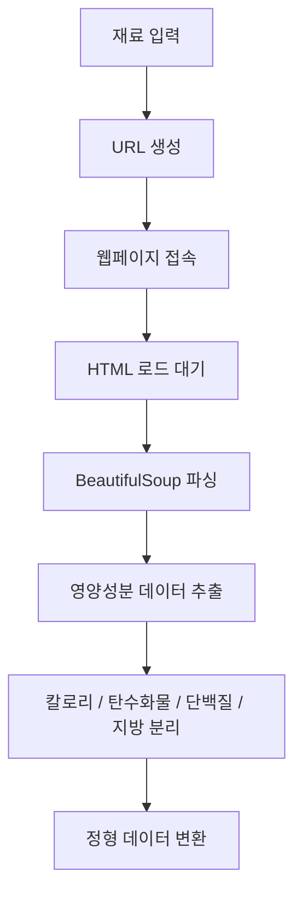
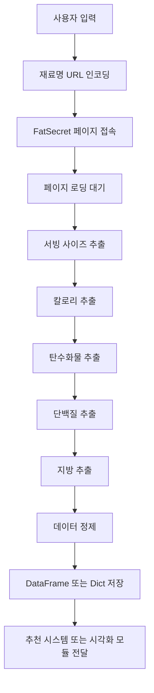

# Crawling2.py 설계 문서(Sprint3)

> (데이터 수집 - Crawling/Crawling2.py)

---

## 1. 개요 (Overview)

Crawling2.py 모듈은 식재료의 **영양성분(칼로리, 탄수화물, 단백질, 지방)** 데이터를 수집하기 위한 크롤링 모듈이다.  

사용자가 입력한 재료명을 기반으로 외부 웹사이트에서 영양 정보를 수집하고,  
이를 정형 데이터로 변환하여 **추천 시스템 및 시각화 기능에 활용**하는 것을 목표로 한다.

본 모듈은 기존 레시피 중심 데이터 구조를 확장하여  
**건강 및 영양 기반 서비스로 확장하기 위한 핵심 데이터 수집 모듈**이다.

---

## 2. 역할 (Role)

Crawling2.py 모듈은 다음과 같은 역할을 수행한다.

- 사용자 입력 기반 **식재료 영양성분 데이터 수집**
- 웹페이지에서 **칼로리, 탄수화물, 단백질, 지방 정보 추출**
- 추출된 데이터를 **정형 데이터(Dict / DataFrame) 형태로 변환**
- 추천 시스템 및 시각화 모듈에 전달
- 중복 크롤링 방지를 위한 **데이터 캐싱 또는 DB 연동 기반 확장 가능**

---

## 3. 사용 기술 (Technology) (개선 및 보완)

| 라이브러리 | 역할 |
| --- | --- |
| Selenium | 동적 웹 페이지 크롤링 및 렌더링 처리 |
| BeautifulSoup (bs4) | HTML 파싱 및 데이터 추출 |
| webdriver_manager | ChromeDriver 자동 설치 및 버전 관리 |
| time | 페이지 로딩 대기 |
| re | 문자열 정제 및 영양성분 값 추출 |
| pandas | 수집 데이터 구조화 및 DataFrame 변환 |

---

### 🔗 사용 URL

> https://www.fatsecret.kr/%EC%B9%BC%EB%A1%9C%EB%A6%AC-%EC%98%81%EC%96%91%EC%86%8C/%EC%9D%BC%EB%B0%98%EB%AA%85/{재료}

- `{재료}` 부분에 식재료명을 URL 인코딩하여 삽입
- 예: 닭가슴살 → 닭가슴살 (URL 인코딩 필요)

---

### 🎯 주요 Selector 정보

#### 1️⃣ 서빙 사이즈 (Serving Size)

```css
#content > table > tbody > tr > td.leftCell > div > table > tbody > tr > td.factPanel > div.nutrition_facts.international > div.serving_size.black.serving_size_value
```

#### 2️⃣ 칼로리 (Calories)

```css
#content > table > tbody > tr > td.leftCell > div > table > tbody > tr > td.factPanel > div.nutrition_facts.international > div:nth-child(12)
```

#### 3️⃣ 탄수화물 (Carbohydrates)

```css
#content > table > tbody > tr > td.leftCell > div > table > tbody > tr > td.factPanel > div.nutrition_facts.international > div:nth-child(15)
```

#### 4️⃣ 단백질 (Protein)

```css
#content > table > tbody > tr > td.leftCell > div > table > tbody > tr > td.factPanel > div.nutrition_facts.international > div:nth-child(21)
```

#### 5️⃣ 지방 (Fat)

```css
#content > table > tbody > tr > td.leftCell > div > table > tbody > tr > td.factPanel > div.nutrition_facts.international > div:nth-child(24)
```

## 4. 데이터 흐름 (Flow)



---

## 5. 전체 동작 흐름 (Pipeline)



---

## 6. 설계 의도 (Why this design?)

기존 크롤링 시스템은 레시피 중심의 데이터(재료, 조리법)에 초점을 맞추고 있었지만,  
사용자에게 더 유용한 정보를 제공하기 위해서는 **식재료의 영양성분 데이터**가 필요하다.

Crawling2.py는 이러한 확장을 위해 설계된 모듈로, 다음과 같은 목적을 가진다.

- 식재료별 **영양 정보 데이터 확보**
- 챗봇에서 **건강 기반 추천 기능 강화**
- 칼로리 및 영양성분 기반 **맞춤형 추천 시스템 확장**

핵심 설계 방향은 다음과 같다.

- 동적 페이지 대응을 위한 **Selenium 기반 크롤링**
- HTML 구조 분석을 위한 **BeautifulSoup 활용**
- 식재료 중심의 **정형 데이터 수집**
- 기존 데이터 파이프라인과 **유기적 연결 가능**

즉, Crawling2.py는 단순 데이터 수집을 넘어  
**건강/영양 기반 추천 시스템으로 확장하기 위한 핵심 모듈**이다.

---

## 7. 한 줄 정리 (Summary)

> Crawling2.py는 식재료의 칼로리 및 영양성분 정보를 수집하여, 건강 기반 추천 시스템 확장을 가능하게 하는 데이터 수집 모듈이다.

## 8. 현재 상황 및 추가 확장

### 8.1 현재 상황 (Current Status)

현재 Crawling2.py 모듈은 다음 단계까지 진행된 상태이다.

- 식재료 기반 URL 접근 구조 설계 완료
- 영양성분(칼로리, 탄수화물, 단백질, 지방) Selector 정의 완료
- Selenium + BeautifulSoup 기반 크롤링 구조 설계 완료

👉 아직 실제 데이터 저장 및 시각화 기능은 구현되지 않은 상태이며,  
👉 기본적인 **데이터 수집 단계(Foundation Layer)** 구축이 완료된 상태이다.

---

### 8.2 추가 확장 (Future Enhancements)

향후 다음과 같은 기능 확장이 가능하다.

#### 1️⃣ 데이터 시각화 (Visualization)

- matplotlib를 활용한 그래프 생성
- 식재료별 영양 비율 분석

예시

- 도넛 차트 (탄수화물 / 단백질 / 지방 비율)
- 막대 그래프 (칼로리 비교)

---

#### 2️⃣ 영양 기반 추천 시스템 연동

- 저칼로리 음식 추천
- 고단백 식단 추천
- 다이어트 / 벌크업 맞춤 추천

---

#### 3️⃣ 데이터베이스 연동

- 수집된 영양성분 데이터를 DB에 저장
- 레시피 데이터와 결합하여 통합 분석

---

#### 4️⃣ 실시간 검색 최적화

- 동일 재료 중복 크롤링 방지 (캐싱)
- DB 우선 조회 → 없을 경우 크롤링

---

#### 5️⃣ AI 기반 영양 분석 확장

- 사용자 건강 상태 기반 추천
- 식단 자동 구성 (Meal Planning)
- 영양 불균형 분석

---

## 🧾 한 줄 정리 (확장 포함)

> Crawling2.py는 식재료의 영양성분 데이터를 수집하고, 향후 시각화 및 건강 기반 추천 시스템으로 확장 가능한 핵심 데이터 수집 모듈이다.
