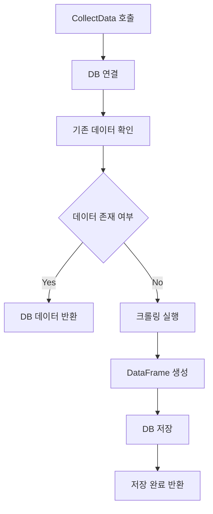
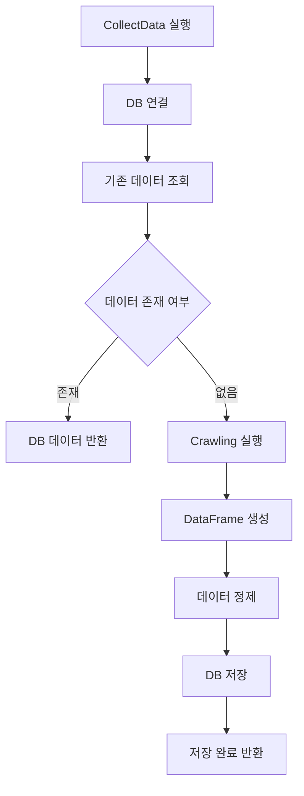

# CollectData.py 설계 문서

---

## 1. 개요 (Overview)

`CollectData.py` 모듈은 웹 크롤링으로 수집된 레시피 데이터를  
데이터베이스 또는 파일 형태로 저장하고 관리하는 역할을 수행한다.

본 모듈의 핵심 목적은 **불필요한 반복 크롤링을 줄이고 데이터 재사용성을 극대화하는 것**이다.

기존 방식처럼 매 요청마다 크롤링을 수행하면 다음과 같은 문제가 발생한다.

- 불필요한 네트워크 요청 증가
- 크롤링 시간 비용 증가
- 서버 부하 증가
- 메모리 누수 가능성 증가

따라서 본 시스템은 다음 구조를 따른다.

> ✔ "먼저 저장된 데이터를 탐색하고, 없을 때만 크롤링 실행"

---

## 2. 역할 (Responsibilities)

`CollectData.py`는 다음 기능을 수행한다.

- 크롤링 결과 DataFrame 저장
- SQLite 또는 CSV 기반 데이터 저장
- 기존 데이터 존재 여부 확인
- 데이터 업데이트 및 교체
- Crawling.py와 연동하여 데이터 저장 처리

---

## 3. 사용 기술 (Technology)

| 기술 | 역할 |
| ------ | ------ |
| Python | 전체 로직 구현 |
| Pandas | DataFrame 처리 |
| SQLite | 로컬 DB 저장 |
| SQLAlchemy (optional) | DB 연동 확장 가능 |

---

## 4. 전체 순서도 (Flow)



---

## 5. 데이터 저장 구조

수집된 레시피 데이터는 데이터 분석 및 추천 시스템에서 활용할 수 있도록  
정형화된 구조로 저장된다.

### Recipe Table 구조

| 컬럼 | 설명 |
| ------ | ------ |
| id | 고유 식별자 (Primary Key) |
| title | 레시피 제목 |
| url | 레시피 상세 페이지 URL |
| ingredients | 재료 리스트 (문자열 또는 JSON 형태) |
| created_at | 데이터 수집 시간 |

---

## 6. 핵심 로직

### 6-1. DB 연결

CollectData 모듈은 먼저 로컬 데이터베이스(SQLite)를 연결하거나  
파일이 존재하지 않을 경우 자동으로 생성한다.

```python id="db1"
import sqlite3

conn = sqlite3.connect("recipes.db")
```

### 6-2. DataFrame → SQL 저장

크롤링을 통해 생성된 `DataFrame`은 SQLite 데이터베이스로 저장된다.  
이 과정은 데이터 재사용성과 빠른 조회 성능을 확보하기 위한 핵심 단계이다.

```python id="sqlsave1"
df.to_sql(
    name="recipes",
    con=conn,
    if_exists="replace",
    index=False
)
```

특징

- 항상 최신 데이터 유지
- 데이터 중복 방지
- 구조 단순화
- 조회 속도 향상

설명

- name: 저장할 테이블 이름
- con: DB 연결 객체
- if_exists="replace": 기존 데이터 삭제 후 최신 데이터로 교체
- index=False: DataFrame index 미저장

### 6-3. 저장 전략

본 모듈은 데이터의 최신성을 유지하기 위해 **Replace 전략**을 기본으로 사용한다.

```python id="save_strategy_01"
df.to_sql(
    name="recipes",
    con=conn,
    if_exists="replace",
    index=False
)
```

특징

- 기존 데이터 삭제 후 최신 데이터로 교체
- 데이터 중복 문제 방지
- 항상 최신 크롤링 결과 유지
- 간단하고 안정적인 구조

---

## 7. 동작 흐름 설명



---

## 8. 설계 의도 (Why this design?)

CollectData 모듈은 단순한 데이터 저장 기능이 아니라  
**크롤링 시스템 전체의 효율성을 개선하기 위한 구조적 설계**를 목표로 한다.

### 1. 크롤링 비용 최소화

- 매 요청마다 크롤링을 수행하면 네트워크 비용과 시간이 과도하게 증가함
- 데이터 저장 구조를 통해 **반복 크롤링 제거**

### 2. 성능 최적화

- DB 조회는 크롤링보다 훨씬 빠르기 때문에
- 사용자 요청 시 **즉시 데이터 제공 가능**

### 3. 시스템 안정성 확보

- 크롤링 빈도 감소 → 서버 차단(IP Ban) 위험 감소
- Selenium 사용 시 발생할 수 있는 리소스 문제 최소화

### 4. 데이터 재사용 구조

- 한 번 수집한 데이터를 여러 기능에서 재사용 가능
  - 추천 시스템
  - 검색 기능
  - 챗봇 응답

---

## 9. 확장 가능성

CollectData 모듈은 향후 다음과 같이 확장될 수 있다.

### 1. 증분 크롤링 (Incremental Crawling)

- 전체 데이터를 다시 크롤링하지 않고
- 변경된 데이터만 업데이트

### 2. 캐싱 시스템 도입

- Redis 또는 Memory Cache를 활용하여
- DB 조회보다 더 빠른 응답 구조 구성 가능

### 3. 스케줄러 연동

- `scheduler.py`와 연결하여
- 주기적으로 자동 데이터 업데이트 수행

### 4. 사용자 맞춤 데이터 구조

- 사용자별 검색 기록 저장
- 개인화 추천 시스템 기반 데이터 축적

### 5. AI 추천 시스템 연동

- 저장된 데이터를 기반으로
- 유사도 기반 추천 또는 ML 모델 학습 가능

---

## 10. 한 줄 정리

**CollectData 모듈은 크롤링 데이터를 저장하고 재사용함으로써 시스템 효율성과 성능을 동시에 최적화하는 데이터 관리 핵심 모듈이다.**
