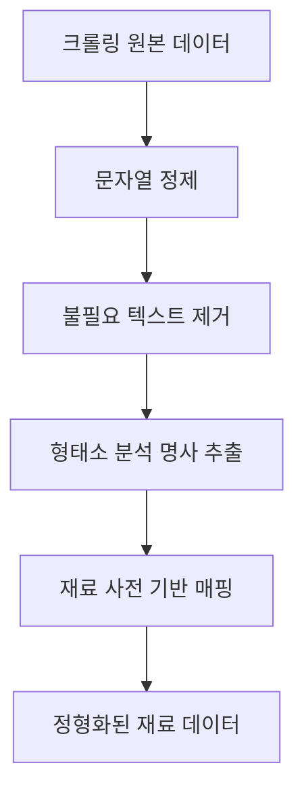
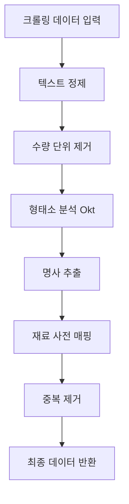

# DataClean.py 설계 문서

> (데이터 정제 모듈 - Utils/DataClean.py)

---

## 1. 개요 (Overview)

DataClean.py 모듈은 웹 크롤링을 통해 수집된 **비정형 텍스트 데이터**를  
정형화된 데이터로 변환하기 위한 데이터 정제(Cleaning) 모듈이다.

특히 레시피 재료 데이터에서 불필요한 정보(수량, 단위, 특수문자 등)를 제거하고,  
**의미 있는 재료(Entity)**만 추출하는 것을 목표로 한다.

---

## 2. 역할 (Role)

- 크롤링 데이터의 노이즈 제거
- 재료명에서 수량 및 단위 제거
- 형태소 분석을 통한 핵심 명사 추출
- 재료 사전을 활용한 표준화(Normalization)
- 챗봇 및 추천 시스템에 적합한 데이터 형태로 가공

---

## 3. 사용 기술 (Technology)

| 라이브러리 | 역할 |
| --- | --- |
| re | 정규표현식을 통한 문자열 정제 |
| konlpy (Okt) | 형태소 분석을 통한 명사 추출 |

---

## 4. 데이터 흐름 (Flow)

---

## 5. 전체 동작 흐름 (Pipeline)

---

## 6. 설계 의도 (Why this design?)

웹 크롤링으로 수집된 데이터는 대부분 비정형 텍스트로,  
다음과 같은 문제를 포함하고 있다.

- 수량, 단위, 특수문자 등 **불필요한 정보 혼합**
- 동일 재료의 다양한 표현 (예: "한우", "소고기", "불고기용 소고기")
- 챗봇 및 추천 시스템에서 사용하기 어려운 형태

이를 해결하기 위해 다음과 같은 설계 전략을 적용하였다.

- **정규표현식(re)** 기반 필터링으로 노이즈 제거
- **형태소 분석(Okt)**을 활용한 명사(Entity) 추출
- **재료 사전(Dictionary)** 기반 표준화로 데이터 일관성 확보

이 구조를 통해 단순한 텍스트 정제가 아닌,  
**의미 중심의 데이터 가공(Entity Extraction)**이 가능해진다.

---

## 7. 한 줄 정리 (Summary)

> DataClean.py는 크롤링된 텍스트에서 의미 있는 재료(Entity)만 추출하여, 챗봇과 추천 시스템에서 활용 가능한 정형 데이터로 변환하는 모듈이다.

---

## 8. 현재 상황 (Current Status)

- 정규표현식 기반 기본 정제 로직 설계 완료
- 형태소 분석(Okt) 적용 구조 설계 완료
- 재료 사전(Dictionary) 기반 표준화 구조 설계 완료

### 🚧 향후 개발 예정

- 재료 사전 자동 확장 기능
- 오탈자 보정 및 유사어 처리
- 사용자 입력 기반 학습 기능
- 영양성분 데이터(Crawling2)와 연계
