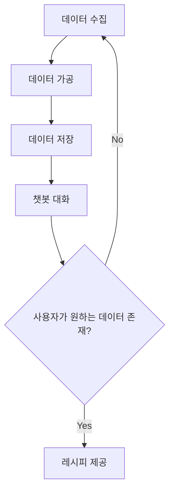
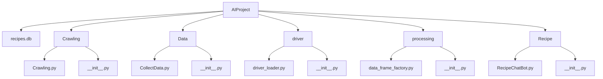
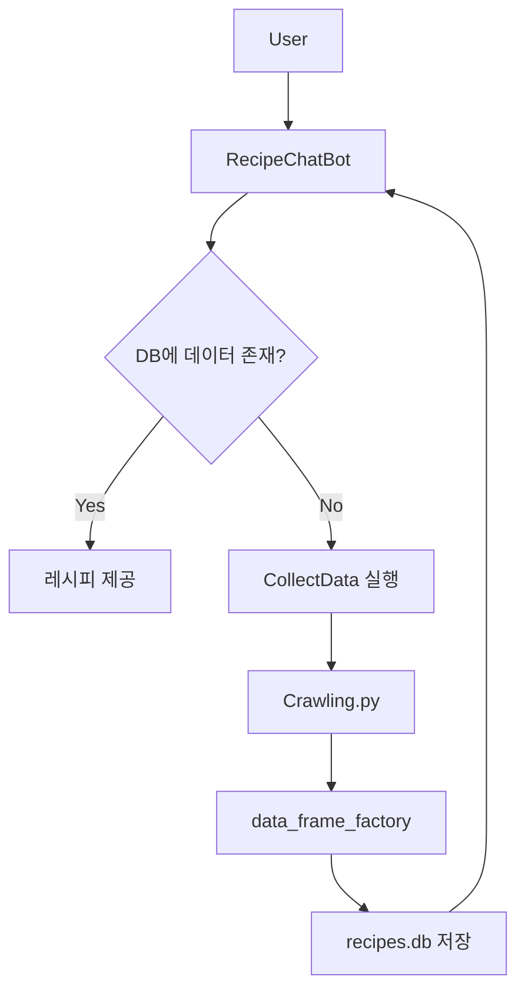
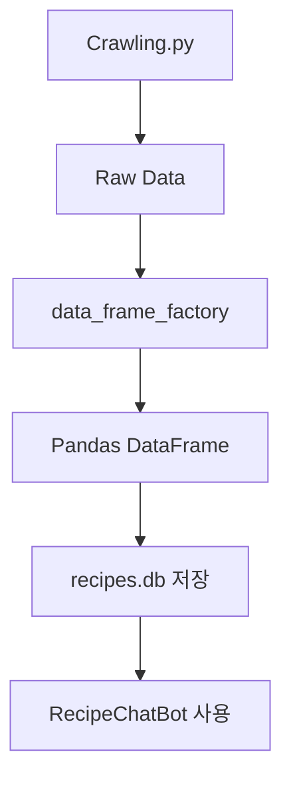
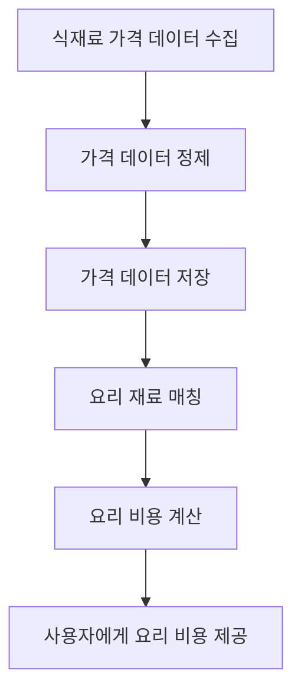

# 🍳 Recipe AI Chatbot Project

## 1. 프로젝트 개요 (Overview)

본 프로젝트는 **1인 자취생**, **요리 초보자**, **요리를 배우고 싶은 사용자**를 위해 개발되는 **요리 챗봇 시스템**이다.

사용자는 챗봇과 자연스럽게 대화하면서 다음과 같은 정보를 얻을 수 있다.

- 원하는 **요리 레시피**
- 필요한 **식재료**
- **요리 순서**
- **요리 방법**

이 시스템은 웹 스크래핑을 통해 레시피 데이터를 수집하고, 데이터를 가공 및 저장한 뒤 **챗봇을 통해 사용자에게 제공하는 구조**로 설계된다.

또한 사용자가 원하는 레시피가 데이터베이스에 존재하지 않을 경우 **자동으로 데이터를 수집하는 구조**를 가진다.

---

# 2. 프로젝트 목적 (Purpose)

본 프로젝트의 목적은 다음과 같다.

- 요리를 어려워하는 사용자를 위한 **대화형 요리 안내 시스템 구축**
- 웹 스크래핑을 통한 **레시피 데이터 자동 수집**
- 데이터 기반 **요리 추천 시스템 구현**
- 챗봇을 통한 **사용자 맞춤형 요리 가이드 제공**

---

# 3. 사용 언어 (Technology)

본 프로젝트에서는 다음 언어 및 기술을 사용한다.

| 기술 | 역할 |
|-----|-----|
| Python | 전체 시스템 개발 |
| Selenium | 웹 스크래핑 |
| BeautifulSoup | HTML 파싱 |
| Pandas | 데이터 처리 |
| SQLite | 레시피 데이터 저장 |
| Matplotlib | 데이터 시각화 |
| Regex (re) | 문자열 정제 |

---

# 4. 시스템 흐름도 (System Flow)

## 흐름 설명
1. 웹 스크래핑을 통해 레시피 데이터 수집
2. 수집된 데이터를 정제 및 가공
3. 데이터를 DB에 저장
4. 사용자가 챗봇과 대화
5. DB에 데이터가 존재하면 즉시 제공
6. 데이터가 없으면 다시 데이터 수집 수행

---

# 5. 프로젝트 폴더 구조 (Project Structure)

본 프로젝트는 **모듈화된 구조**로 설계되어 있으며,  
데이터 수집, 데이터 가공, 챗봇 처리, 드라이버 설정 등을 각각의 폴더로 분리하였다.

이 구조는 다음과 같은 장점을 가진다.

- 코드 재사용성 증가
- 유지보수 효율 향상
- 기능 확장 용이
- 역할 기반 모듈 분리

---

## 프로젝트 폴더 구조

---

# 6. 프로젝트 구조 다이어그램 (Architecture)

프로젝트는 **데이터 수집 → 데이터 처리 → 데이터 저장 → 챗봇 서비스** 구조로 설계되어 있다.

## 구조 설명
- 사용자는 챗봇과 대화를 통해 요리를 요청한다.
- 챗봇은 DB에서 레시피 데이터를 검색한다.
- 데이터가 존재하면 레시피 정보를 사용자에게 제공한다.
- 데이터가 없으면 데이터 수집 모듈을 실행하여 새로운 데이터를 수집한다.

---
# 7. 각 파일 설명 (Module Description)

## Crawling.py

웹 스크래핑을 통해 **레시피 데이터를 수집하는 모듈**이다.

### 주요 기능

- 레시피 검색 페이지 접근
- 레시피 제목 추출
- 레시피 URL 추출
- 상세 페이지에서 재료 정보 수집

### 특징

- 카테고리 리스트를 순회하며 **각 키워드당 N개의 레시피 데이터를 수집**
- 상세 페이지에서 **재료 및 레시피 정보를 추가로 파싱**
- 수집된 데이터는 후처리 모듈로 전달

---

## RecipeChatBot.py

사용자와 대화하며 레시피 정보를 제공하는 **챗봇 모듈**이다.

### 주요 기능

- DB에서 레시피 데이터 로드
- 사용자 질문 분석
- 레시피 추천 및 요리 방법 제공

### 특징

- 사용자 페르소나 기반 대응 가능

예시 사용자 유형

- 요리 초보 사용자
- 자취생
- 특정 식재료 기반 요리 검색 사용자

---

## CollectData.py

데이터 수집을 담당하는 **데이터 공급 모듈**이다.

### 주요 기능

- 레시피 데이터 자동 수집
- Crawling 모듈 실행
- 데이터 업데이트

### 사용 목적

- 챗봇 실행 전 **데이터 초기 수집**
- 정기적인 **데이터 업데이트**

---

## driver_loader.py

Selenium WebDriver 설정을 담당하는 **Driver 관리 모듈**이다.

### 주요 기능

- Chrome Driver 설정
- Headless 모드 실행
- Driver 옵션 설정

### 특징

- 크롤링 코드에서 **Driver 설정 재사용 가능**
- 코드 중복 제거

---

## data_frame_factory.py

수집된 데이터를 **정형 데이터로 변환하는 모듈**이다.

### 주요 기능

- dict 형태 데이터 입력
- Pandas DataFrame 변환
- 데이터 저장 처리

### 역할

- 크롤링 데이터 → **분석 가능한 데이터 구조로 변환**

---

# 8. 데이터 처리 흐름 (Data Processing Flow)

## 처리 과정
1. Crawling.py가 레시피 데이터를 수집
2. Raw Data 형태로 생성
3. data_frame_factory가 데이터를 DataFrame으로 변환
4. DB에 저장
5. 챗봇이 DB 데이터를 사용하여 응답 생성

---

# 9. 확장 계획 (Future Expansion)

본 프로젝트는 기본적인 **레시피 챗봇 시스템**을 기반으로 하며, 향후 다양한 데이터와 기능을 확장하여 **요리 데이터 플랫폼**으로 발전시키는 것을 목표로 한다.

---

## 1️⃣ 영양 정보 분석 기능

레시피에 포함된 식재료 데이터를 기반으로 **영양 정보를 계산하고 제공하는 기능**을 추가할 예정이다.

### 제공 예정 영양 정보

- 칼로리 (Calories)
- 단백질 (Protein)
- 지방 (Fat)
- 탄수화물 (Carbohydrates)

### 활용 방식

- 레시피별 영양 정보 제공
- 건강 식단 추천
- 다이어트용 요리 추천

---

## 2️⃣ 식재료 가격 분석 기능

식재료 가격 데이터를 수집하여 **요리 비용을 계산하는 기능**을 추가할 예정이다.

### 주요 기능

- 요리 예상 비용 계산
- 식재료 가격 비교
- 가장 저렴한 요리 추천

### 데이터 흐름

## 3️⃣ 데이터 시각화 기능
수집된 데이터를 기반으로 다양한 데이터 시각화 기능을 제공할 예정이다.
### 사용 기술
- matplotlib
- Pandas

### 제공 예정 그래프
- 영양 성분 분석 그래프
- 식재료 가격 비교 그래프
- 레시피 카테고리 분포 그래프

### 예시
- 도넛 차트 (Donut Chart)
- 막대 그래프 (Bar Chart)
- 파이 차트 (Pie Chart)

---