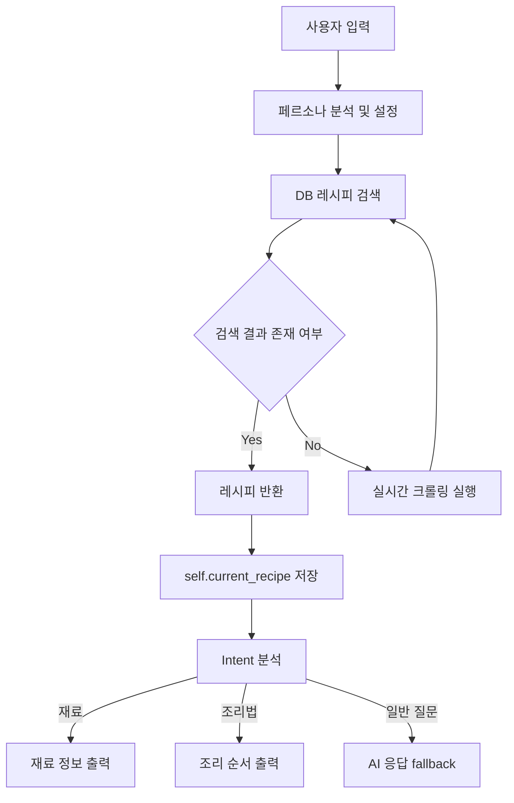

# RecipeChatBot.py 설계 문서

---

## 1. 개요 (Overview)

`RecipeChatBot.py`는  
크롤링 및 전처리된 레시피 데이터(`processed_df`)를 기반으로  
사용자와 자연스럽게 대화하며 요리를 추천하고 설명하는 **데이터 기반 하이브리드 챗봇 모듈**이다.

이 챗봇은 단순 생성형 AI가 아니라  
→ **데이터 우선 검색 + AI 보조 응답 구조**를 가진다.

---

## 2. 사용 라이브러리 (Libraries)

```python
import sqlite3
import pandas as pd
from Crawling.Crawling import RecipeCrawler
```

### 1. sqlite3

- 로컬 데이터베이스(SQLite) 관리
- 크롤링된 레시피 데이터를 영구 저장
- 별도 서버 없이 파일 기반 DB 사용 가능

### 2. pandas

- DataFrame 기반 데이터 처리
- 크롤링 데이터 정제 및 구조화
- SQLite ↔ DataFrame 변환 (read_sql, to_sql) 지원

### 3. RecipeCrawler (Crawling 모듈)

- 레시피 데이터 수집 담당 모듈
- 검색어 기반 크롤링 실행
- 제목, URL, 재료, 조리법 추출
- DB 저장 전 원본 데이터 제공

---

## 3. 데이터 바인딩 (Data Binding)

크롤링된 데이터프레임(`processed_df`)이 그대로 챗봇 클래스에 주입된다.

### 핵심 개념

- 챗봇 = “레시피 외장 하드”
- 모든 응답의 기준은 DB(DataFrame)
- AI는 보조 역할

---

## 4. 학습 구조 (Training / Intent Matching)

`ListTrainer`를 통해 기본 레시피 제목을 학습한다.

### 효과

- "백종원 목살스테이크" → 맥락 이해 가능
- 단순 키워드 입력에도 자연스러운 응답 생성

---

## 5. 지능형 조건 분기 (Intent Parsing)

사용자의 입력을 분석하여 의도를 분류한다.

### 분기 로직

- "재료" 포함 → 재료 출력
- "순서" / "레시피" 포함 → 조리 과정 출력
- 일반 입력 → DB 검색 → AI fallback

---

## 6. 상태 관리 (Stateful Context)

```python id="state_var"
self.current_recipe
```

### 역할

- 이전에 선택한 레시피 기억
- 후속 입력 (“재료”, “순서”) 자동 연결
- 대화 흐름 유지

## 7. 페르소나 기반 응답 시스템 (Persona System)

사용자의 상황과 목적에 따라 추천 방식과 응답 전략을 다르게 적용하는 기능이다.

### 페르소나 예시

- 1인 자취생 → 간단 요리 / 최소 재료
- 다이어트 사용자 → 저칼로리 레시피 우선
- 초보 요리자 → 쉬운 조리 과정 우선
- 가족 요리 → 대용량 / 공유형 레시피

### 동작 방식

- 사용자 입력 분석
- 페르소나 자동 설정 또는 수동 변경
- DB 검색 시 페르소나 조건 필터 적용
- 결과에 맞는 추천 강화

---

## 8. 전체 동작 흐름 (Flow)



---

## 9. 설계 의도 (Why this design?)

이 챗봇은 단순한 생성형 AI가 아니라 **데이터 기반 하이브리드 응답 시스템**으로 설계되었다.

### 핵심 설계 방향

- **Data First 구조**
  - AI보다 크롤링된 레시피 데이터가 우선

- **Context 기반 대화**
  - `self.current_recipe`를 통해 이전 대화 상태 유지

- **Hybrid Architecture**
  - 1차: DB(DataFrame) 검색
  - 2차: 실시간 크롤링
  - 3차: AI fallback (ChatterBot)

- **사용자 경험 중심 설계**
  - 최소 입력 → 최대 정보 제공 구조

---

## 10. 핵심 개선 포인트

### 1. 데이터 우선 구조 (Data-First Design)

- 모든 응답은 DB 검색이 1순위
- AI는 보조 역할로 제한

---

### 2. 상태 기반 대화 유지 (Context Awareness)

```python id="ctx_keep"
self.current_recipe
```

- 이전 선택 레시피 기억
- “재료”, “순서” 같은 짧은 입력도 해석 가능

### 3. 유연한 검색 처리 (Flexible Search)

사용자의 입력 방식이 달라도 동일한 결과를 찾을 수 있도록 검색 로직을 유연하게 설계한다.

#### 핵심 전략

- 공백 제거 기반 검색
- 부분 문자열 매칭 허용
- 키워드 중심 검색 (title 기반)
- 오타 및 축약 입력 대응

#### 예시

| 사용자 입력 | 매칭 결과 |
| ------------- | ------------ |
| 목살 스테이크 | 목살스테이크 |
| 김치 찌개 | 김치찌개 |
| 된 장 찌개 | 된장찌개 |

---

### 4. 하이브리드 구조 (Hybrid Architecture)

이 챗봇은 단일 AI 모델이 아닌 **데이터 + AI 혼합 구조**로 동작한다.

#### 구조 정의

- 1순위: DataFrame(DB) 검색
- 2순위: 크롤링 실시간 수집
- 3순위: AI 응답 (Fallback)

#### 특징

- 데이터 기반 정확성 확보
- AI의 비정확성 보완
- 비용 및 리소스 절감

---

### 5. 사용자 중심 UX (User-Centered UX)

사용자의 입력 부담을 최소화하고 결과 중심의 인터페이스를 제공한다.

#### UX 설계 원칙

- 짧은 입력으로도 결과 제공
- 자연어 기반 대화 지원
- 이전 대화 상태 자동 유지
- 추천 먼저 제시 (능동형 시스템)

#### UX 특징

- "무엇을 만들지 몰라도 시작 가능"
- "한 단어 입력으로 요리 추천"
- "추가 입력 없이 이어지는 대화"

---

## 11. 확장 기능 (Persona System 강화)

사용자의 상황과 목적에 따라 추천 시스템이 자동으로 변경된다.

### Persona 예시

- 1인 가구
- 다이어트 사용자
- 자취생
- 요리 초보
- 가족 요리 사용자

### 동작 흐름

```mermaid id="persona_flow_02"
flowchart TD
A[사용자 입력] --> B[페르소나 분석]
B --> C{페르소나 존재 여부}
C -->|없음| D[페르소나 자동 설정]
C -->|있음| E[기존 페르소나 유지]
D --> F[DB 검색 (페르소나 필터 적용)]
E --> F
F --> G{결과 존재 여부}
G -->|Yes| H[맞춤형 레시피 제공]
G -->|No| I[실시간 크롤링 실행]
I --> F
```


### 확장 방향

- 칼로리 기반 추천
- 알레르기 필터
- 다이어트/벌크업 식단 추천
- 시간 기반 레시피 추천 (10분/30분 요리)

## 12. 한 줄 정리 (Summary)

> 크롤링된 레시피 데이터를 기반으로 사용자 의도와 상황(페르소나)을 분석하여, 재료·조리법·추천을 맥락적으로 제공하는 데이터 중심 하이브리드 요리 챗봇이다.
