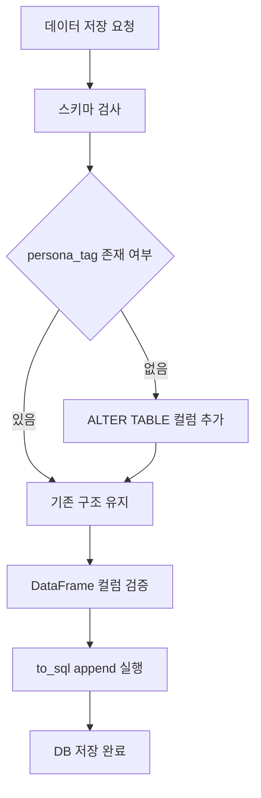

# 🛠️ DB 스키마 불일치 에러 해결 가이드

---

## 🚨 1. 에러 내용

```text
sqlite3.OperationalError: table recipes has no column named persona_tag
```

## 📌 2. 원인 분석 (Root Cause)

해당 에러는 **DB 테이블 구조와 DataFrame 구조가 일치하지 않아서 발생**합니다.

### ✔ 상황 흐름

1. 기존 `recipes` 테이블 생성 (persona_tag 없음)
2. 코드에서 `persona_tag` 컬럼 추가
3. DB는 변경되지 않음
4. `to_sql(..., append)` 실행
5. ❌ 존재하지 않는 컬럼 삽입 → 에러 발생

👉 즉,

> **DB 스키마 ≠ DataFrame 스키마**

---

## ✅ 3. 해결 방법

### ✔ 방법 1: 자동 스키마 업데이트 (권장 ⭐)

```python
self._upgrade_schema()

def _upgrade_schema(self):
    conn = sqlite3.connect(self.db_path)
    cursor = conn.cursor()
    
    try:
        cursor.execute("PRAGMA table_info(recipes)")
        columns = [column[1] for column in cursor.fetchall()]
        
        if 'persona_tag' not in columns:
            cursor.execute("ALTER TABLE recipes ADD COLUMN persona_tag TEXT")
            conn.commit()
    finally:
        conn.close()
```

## 3.2 테이블 재생성 (개발 초기용)

```python
df.to_sql('recipes', conn, if_exists='replace', index=False)
```

✔ 가장 빠른 해결 방법

- ✔ 테이블 구조를 DataFrame 기준으로 재생성
- ❌ 기존 데이터 모두 삭제됨

👉 초기 개발 단계에서만 사용 권장

## 3.3 수동 SQL 실행

```sql
ALTER TABLE recipes ADD COLUMN persona_tag TEXT;
```

✔ DB에 직접 접근하여 컬럼을 추가하는 방법
✔ 빠르게 문제 해결 가능
❌ 반복 실행 시 오류 발생 가능 (이미 존재할 경우)


## 🔒 4. 안전한 저장 코드 (Best Practice)

```python
def _save_to_db(self, df):
    # 1. 스키마 자동 업데이트
    self._upgrade_schema()

    # 2. 컬럼 안전 보장
    if 'persona_tag' not in df.columns:
        df['persona_tag'] = None

    # 3. DB 저장
    conn = sqlite3.connect(self.db_path)
    df.to_sql('recipes', conn, if_exists='append', index=False)
    conn.close()
```

✔ 스키마 자동 보정
✔ 컬럼 누락 방지
✔ 안정적인 DB 저장 가능

## 🧠 5. 핵심 개념

- `to_sql(if_exists='append')`는 **DB 테이블 구조와 DataFrame 컬럼이 완전히 동일해야만 정상 동작**한다  
- 새로운 컬럼을 코드에 추가했다면 **DB 스키마도 반드시 함께 업데이트해야 한다**  
- SQLite는 스키마 변경 시 자동 반영이 되지 않기 때문에 **명시적인 ALTER TABLE 작업이 필요하다**  
- 실무에서는 이를 해결하기 위해 **자동 스키마 마이그레이션 로직을 반드시 포함한다**

---

## 🚀 6. 설계 개선 포인트

### 6.1 자동 스키마 마이그레이션

- 실행 시 DB 구조를 검사하고 필요한 컬럼을 자동 추가
- 유지보수 비용 감소 및 안정성 증가

### 6.2 컬럼 방어 코드 (Defensive Programming)

```python
if 'persona_tag' not in df.columns:
    df['persona_tag'] = None
```

- 예외 상황에서도 시스템이 깨지지 않도록 보호

## 6.3 초기 DB 스키마 정의

프로젝트 초기 단계에서 **DB 구조를 명확하게 정의**하면  
추후 컬럼 누락 및 스키마 불일치 문제를 예방할 수 있습니다.

```sql
CREATE TABLE IF NOT EXISTS recipes (
    id INTEGER PRIMARY KEY AUTOINCREMENT,
    title TEXT,
    url TEXT,
    materials TEXT,
    steps TEXT,
    persona_tag TEXT
);
```

✔ 초기 설계 단계에서 컬럼을 포함하여 생성
✔ 이후 ALTER TABLE 최소화
✔ 데이터 무결성 유지

## 🧩 7. 전체 흐름 (Mermaid)



## 🧾 8. 한 줄 정리 (Summary)

> 이 에러는 DB 스키마와 DataFrame 구조 불일치로 발생하며, 실행 시 자동으로 컬럼을 추가하는 방식으로 안정적으로 해결할 수 있다.
