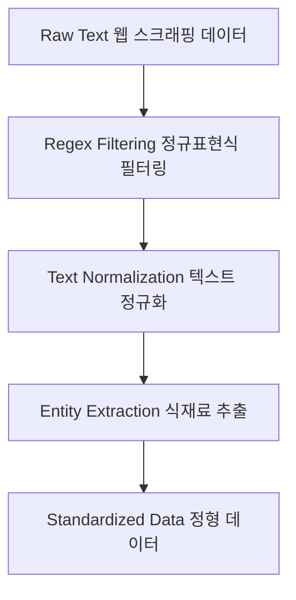
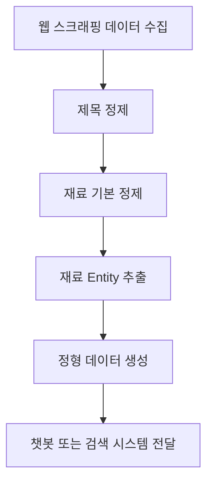

# data_processor 설계 문서

## 1. 개요 (Overview)

DataCleaner 모듈은 웹 스크래핑을 통해 수집된 **가공되지 않은 텍스트 데이터를 정제하는 역할**을 담당한다.  
웹 데이터는 줄바꿈, 특수문자, 불필요한 설명, 버튼 텍스트 등 다양한 노이즈가 포함되어 있기 때문에  
이를 그대로 사용할 경우 **검색 정확도와 챗봇 응답 품질이 크게 떨어질 수 있다.**

따라서 이 모듈은 다음을 목표로 한다.

- 웹에서 수집된 텍스트 노이즈 제거
- 식재료 이름(Entity) 추출
- 챗봇이 사용하기 쉬운 **정형 데이터(Standardized Data)** 생성

---

## 2. 역할

DataCleaner는 다음과 같은 데이터 정제 역할을 수행한다.

- 웹 스크래핑으로 수집된 **Raw Text 정제**
- 레시피 제목 정리
- 재료 텍스트 정리
- 식재료 **Entity 추출**
- 챗봇 응답에 적합한 **표준화된 데이터 생성**

---

## 3. 사용 라이브러리 (Libraries)

```python
import re
```

| 라이브러리 | 역할 |
| -------- | ------------ |
| re | 정규표현식을 이용한 문자열 필터링 및 패턴 제거 |

---

## 4. 데이터 흐름 (Flow)

웹 스크래핑으로 수집된 데이터에는 다양한 노이즈가 포함된다.  
DataCleaner 모듈은 정규표현식을 활용하여 불필요한 텍스트를 제거하고  
검색 및 챗봇 응답에 적합한 정형 데이터로 변환한다.



---

## 5. 데이터 정제 로직

### 5.1 제목 정제 (Title Cleaning)

웹에서 수집된 레시피 제목에는 줄바꿈, 탭, 불필요한 공백 등이 포함될 수 있다.  
이를 정리하여 **가독성이 좋은 제목 데이터**로 변환한다.

정제 과정

1. 텍스트 내부 줄바꿈(`\n`) 제거
2. 탭(`\t`) 제거
3. 연속된 공백을 단일 공백으로 치환
4. 문자열 앞뒤 공백 제거

예시

Before
> “백종원 김치찌개   \n”

After
> “백종원 김치찌개”

---

### 5.2 재료 기본 정제 (Material Basic Cleaning)

웹페이지에는 재료 텍스트 외에도 버튼 텍스트 및 불필요한 설명이 포함될 수 있다.  
이를 제거하여 **재료명 + 분량 구조**를 유지한다.

정제 과정

1. 버튼 텍스트 `"구매"` 제거
2. 문자열 앞뒤 공백 제거
3. 불필요한 UI 텍스트 제거

예시

Before
> “돼지고기 300g 구매”

After
> “돼지고기 300g”

---

### 5.3 재료 키워드 추출 (Entity Extraction)

목표
> “돼지고기 300g” → “돼지고기”

즉, 숫자와 단위를 제거하고 **식재료 이름(Entity)**만 추출한다.

정제 과정

1. 숫자 및 분수 패턴 제거  
   - 예: `100`, `0.5`, `1/2`

2. 한국 요리 단위 제거  
   - 예: `g`, `kg`, `큰술`, `작은술`, `컵`

3. 부연 설명 제거  
   - 예: `/다진것`, `(선택)`

4. 특수 문자 제거

예시

Before
> “돼지고기 300g”

After
> “돼지고기”

---

## 6. 전체 동작 흐름 (Pipeline)



---

## 7. 설계 의도 (Why this design?)

웹 스크래핑으로 수집된 데이터는 대부분 다음과 같은 문제를 가지고 있다.

- 불필요한 공백 및 줄바꿈
- 버튼 텍스트 및 UI 요소 혼입
- 숫자와 단위가 섞인 재료 문자열
- 불필요한 부연 설명

이러한 데이터를 그대로 사용할 경우 다음 문제가 발생한다.

- 검색 정확도 저하
- 챗봇 응답 품질 저하
- 데이터 분석 정확도 감소

따라서 **DataCleaner 모듈은 데이터의 핵심 정보(Entity)만 남기고 노이즈를 제거하는 것을 목표로 설계되었다.**

핵심 설계 방향

- 데이터의 **본질적인 정보만 유지**
- 챗봇 응답에 적합한 **정형 데이터 생성**
- 검색 및 추천 시스템의 **정확도 향상**

즉, DataCleaner는 **데이터 품질을 책임지는 전처리 계층(Data Preprocessing Layer)** 역할을 수행한다.

---

## 8. 확장 가능성 (Scalability)

DataCleaner 모듈은 향후 다양한 데이터 분석 및 추천 시스템과 연계될 수 있도록 확장 가능하게 설계되었다.

확장 가능 기능

- **식재료 표준 사전 구축**
  - 예: 돼지고기 → pork
  - 양파 → onion

- **동의어 처리 시스템**
  - 예: 양파 / Onion / 흰양파

- **영양 정보 데이터 연결**
  - 칼로리
  - 단백질
  - 지방
  - 탄수화물

- **가격 데이터 연동**
  - 식재료 가격 분석
  - 요리 비용 계산

- **AI 기반 Entity Recognition**
  - 자연어 처리 기반 식재료 추출
  - 재료 분류 자동화

이를 통해 단순한 텍스트 정제를 넘어 **데이터 기반 요리 추천 시스템으로 확장할 수 있다.**

---

## 9. 한 줄 정리 (Summary)

> **DataCleaner는 웹에서 수집된 레시피 텍스트 데이터를 정제하고 핵심 식재료 Entity를 추출하여 챗봇 및 데이터 분석 시스템이 사용할 수 있는 정형 데이터로 변환하는 전처리 모듈이다.**
