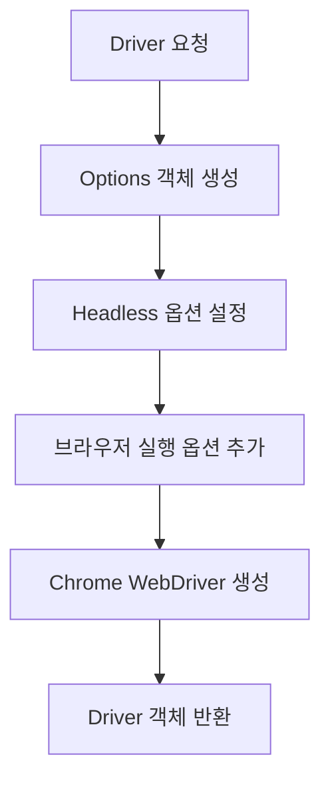
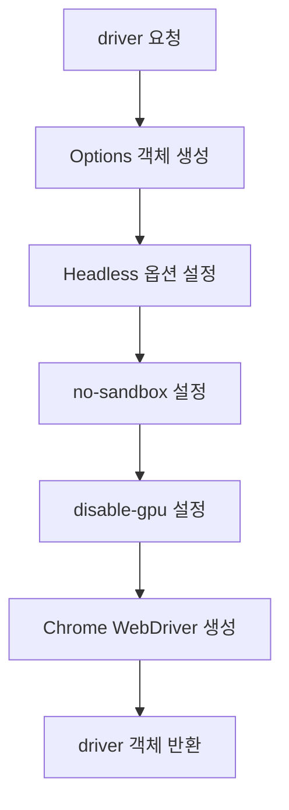
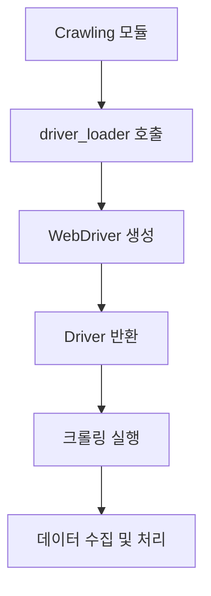

# driver_loader.py 설계 문서

## 1. 개요 (Overview)

`driver_loader.py` 모듈은 **Selenium WebDriver 설정을 담당하는 공통 모듈**이다.  
크롤링 모듈에서 반복적으로 작성되는 WebDriver 설정 코드를 **하나의 모듈로 분리**하여  
재사용성과 유지보수성을 높이는 것을 목표로 한다.

이 모듈을 통해 다음과 같은 장점을 얻을 수 있다.

- WebDriver 설정 코드의 **중복 제거**
- 크롤링 코드의 **가독성 향상**
- WebDriver 옵션 **중앙 관리**
- 다양한 크롤링 모듈에서 **공통 사용 가능**

---

## 2. 역할 (Responsibilities)

`driver_loader.py`는 다음과 같은 역할을 수행한다.

- Selenium WebDriver 옵션 설정
- Headless 브라우저 환경 구성
- Chrome WebDriver 생성
- 크롤링 모듈에서 사용할 driver 객체 반환

즉, **크롤링 모듈에서 WebDriver를 직접 생성하지 않고  
driver_loader 모듈을 통해 생성하도록 구조를 설계한다.**

---

## 3. 사용 기술 (Technology)

| 기술 | 역할 |
| ----- | ------ |
| Python | 스크립트 실행 환경 |
| Selenium | 웹 브라우저 자동화 |
| Chrome WebDriver | 크롬 브라우저 제어 |

사용 라이브러리

- Selenium
- `webdriver`
- `Options`

---

## 4. 전체 흐름

driver_loader 모듈의 전체 동작 흐름은 다음과 같다.



---

## 5. 순서도 (Flowchart)

driver_loader 모듈의 실행 흐름은 다음과 같다.



---

## 6. 모듈 사용 구조

`driver_loader.py`는 크롤링 모듈에서 공통적으로 사용되며,  
WebDriver 생성 로직을 중앙에서 관리하는 역할을 수행한다.

전체 구조 흐름은 다음과 같다.



---

## 7. 사용 예시

`driver_loader.py`는 크롤링 모듈에서 WebDriver를 생성할 때 공통적으로 사용된다.

### 기본 사용 방법

```python
from driver.driver_loader import get_driver

driver = get_driver()

driver.get("https://www.10000recipe.com")
```

### Crawling.py에서 사용 예시

```python
from driver.driver_loader import get_driver

def crawl():
    driver = get_driver()

    try:
        driver.get("https://www.10000recipe.com/recipe/list.html?q=김치")
        # 크롤링 로직 수행
    finally:
        driver.quit()
```

---

## 8. 핵심 포인트

### Headless 모드의 중요성

- 브라우저 UI 없이 백그라운드에서 실행
- 크롤링 속도 향상
- 서버 및 자동화 환경에 최적화
- 리소스 사용량 감소

---

### WebDriver 모듈화의 필요성

- Selenium 설정 코드의 중복 제거
- 크롤링 코드의 가독성 향상
- 설정 변경 시 유지보수 용이
- 프로젝트 전체에서 재사용 가능

---

### 안정성 확보 요소

- `no-sandbox`, `disable-gpu` 옵션으로 실행 안정성 확보
- 다양한 OS 환경에서 동일하게 동작하도록 구성
- 크래시 및 렌더링 오류 최소화

---

### 확장 가능 구조

- User-Agent 설정 추가 가능
- Proxy 서버 연동 가능
- 페이지 로드 전략 변경 가능 (`eager`, `normal`)
- Anti-bot 대응 기능 확장 가능

---

## 9. 성능 최적화 전략 (추가 제안)

### 1. Page Load Strategy (`eager`) 적용

본 프로젝트는 이미지나 UI 렌더링이 아닌 **텍스트 기반 데이터(레시피/재료)** 수집이 목적이므로  
페이지 전체 로딩을 기다리는 기본 방식(`normal`)은 비효율적이다.

따라서 `eager` 전략을 기본으로 채택한다.

#### 적용 방식

```python id="eager1"
chrome_options.page_load_strategy = "eager"
```

## 10. 한 줄 정리

driver_loader.py는 Selenium WebDriver 설정을 공통화하여 크롤링 코드의 재사용성과 유지보수성을 높이기 위한 핵심 인프라 모듈이다.