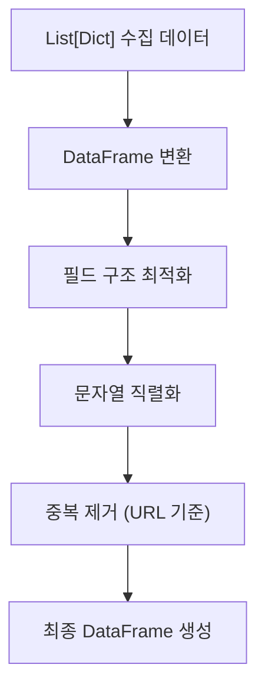
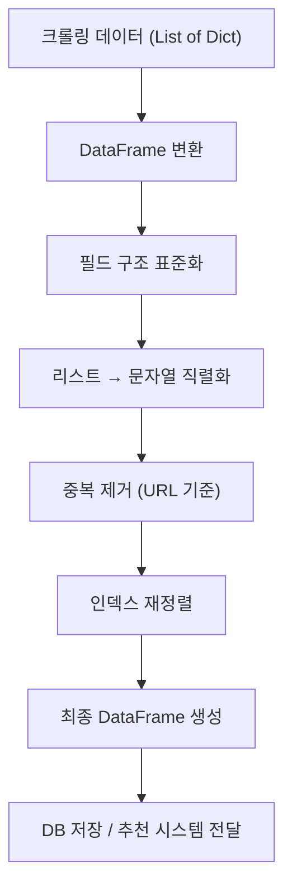

# data_frame_factory.py 설계 문서  

(데이터 가공 라이브러리 - processing/data_frame_factory.py)

---

## 1. 개요 (Overview)

`data_frame_factory.py` 모듈은  
웹 크롤링을 통해 수집된 **dict 형태의 레시피 데이터 리스트**를  
정형화된 DataFrame으로 변환하고, 서비스에서 사용할 수 있도록 가공 및 저장하는 역할을 수행한다.

이 모듈은 단순 변환이 아니라  
→ 데이터 통합  
→ 문자열 직렬화  
→ 중복 제거  
→ 구조 최적화  

까지 포함하는 **데이터 전처리 핵심 모듈**이다.

---

## 2. 역할 (Role)

- 여러 스레드에서 수집된 레시피 dict 리스트 통합
- Pandas DataFrame 변환
- 리스트 데이터를 문자열로 직렬화
- 중복 URL 제거
- 챗봇 응답 최적화 데이터 구조 생성
- SQLite 저장을 위한 데이터 정제

---

## 3. 사용 기술 (Technology)

| 라이브러리 | 역할 |
|------------|------|

| pandas | DataFrame 변환 및 데이터 처리 |

---

## 4. 데이터 흐름 (Flow)



---

## 5. 핵심 처리 로직 (Core Logic)

### 5.1 원본 데이터 구조

수집된 데이터는 기본적으로 `List[Dict]` 형태로 구성된다.

```python id="raw_example"
[
    {
        "title": "김치찌개",
        "url": "/recipe/123",
        "ingredients": ["김치 200g", "돼지고기 100g", "두부 1/2모"]
    },
    {
        "title": "된장찌개",
        "url": "/recipe/456",
        "ingredients": ["된장 2큰술", "두부 1모", "애호박 1/2개"]
    }
]
```

## 5.2 DataFrame 변환

수집된 `List[Dict]` 형태의 데이터를 Pandas DataFrame으로 변환한다.  
이 단계는 모든 후속 데이터 처리의 기준이 되는 **정형 데이터 구조 생성 단계**이다.

```python
df = pd.DataFrame(data_list)
```

## 5.3 리스트 → 문자열 직렬화 (핵심)

챗봇 응답 및 DB 저장을 위해 리스트 형태의 데이터를 문자열로 변환한다.

### 변환 규칙

- 재료 리스트 → 콤마(,) 기반 문자열
- 조리 과정 → 줄바꿈(\n) 기반 문자열
- 필요 시 단위/수량 포함 유지

### 예시

| 항목 | 변환 전 | 변환 후 |
| ------ | -------- | -------- |
| 재료 | ["감자 1개", "양파 1/2개"] | "감자 1개, 양파 1/2개" |
| 정제 재료 | ["감자", "양파"] | "감자, 양파" |
| 조리 과정 | ["1. 씻기", "2. 볶기"] | "1. 씻기\n2. 볶기" |

---

## 5.4 중복 제거 (Data Integrity)

URL 기준으로 동일 레시피 데이터를 제거하여 데이터 중복을 방지한다.

### 처리 방식

```python id="dup_remove"
df = df.drop_duplicates(subset="url")
```

### 효과

- 동일 레시피 중복 저장 방지
- 추천 시스템 정확도 향상
- DB 저장 효율 증가

## 5.5 인덱스 재정렬

중복 제거 이후 데이터의 연속성을 유지하기 위해 인덱스를 재정렬한다.

```python id="reset_index_final"
df = df.reset_index(drop=True)
```

### 목적

- 데이터 인덱스 불연속 문제 해결
- 후속 처리(검색, 추천) 안정성 확보
- UI 출력 시 정렬된 구조 유지

---

## 6. 전체 동작 흐름 (Pipeline)



---

## 7. 설계 의도 (Why this design?)

이 모듈은 단순한 데이터 변환이 아니라 **서비스 레이어와 데이터 수집 레이어를 분리하기 위한 핵심 구조**이다.

### 설계 핵심 목적

- 크롤링 데이터 → 서비스 데이터로 변환하는 “중간 계층” 역할
- 챗봇이 즉시 사용할 수 있는 형태로 데이터 표준화
- DB 저장 이전 단계에서 데이터 품질 보장
- 멀티스레드 환경에서도 일관된 데이터 구조 유지

### 핵심 설계 철학

- “Raw Data → Service Ready Data”
- 데이터는 수집이 아니라 **사용 가능 상태가 중요**
- 모든 리스트 기반 데이터는 문자열로 직렬화하여 호환성 확보

---

## 8. 확장 가능성 (Scalability)

이 구조는 향후 다양한 기능 확장에 유연하게 대응할 수 있다.

### 기능 확장 방향

- **영양 정보 확장**
  - 칼로리, 단백질, 지방, 탄수화물 추가

- **요리 비용 계산 시스템 연동**
  - 재료 가격 데이터와 연결하여 총 요리 비용 산출

- **재료 표준화 시스템**
  - “1/2개”, “100g”, “약간” 등을 정규화

- **추천 시스템 고도화**
  - 단순 키워드 → 벡터 기반 추천 (ML/Embedding)

- **사용자 맞춤 필터링**
  - 알레르기, 다이어트, 선호 음식 기반 필터

---

## 9. 한 줄 정리 (Summary)

> 크롤링으로 수집된 비정형 레시피 데이터를 챗봇과 추천 시스템이 바로 사용할 수 있도록 정제하고 구조화하는 데이터 가공 핵심 모듈이다.
