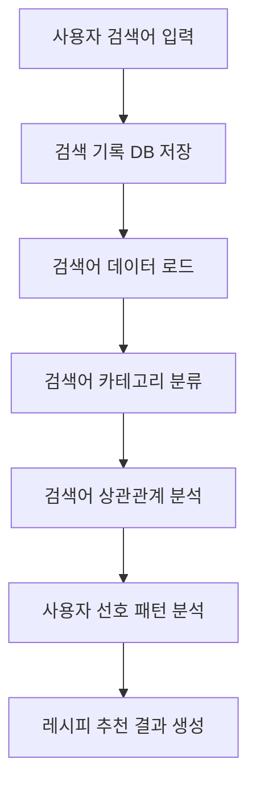
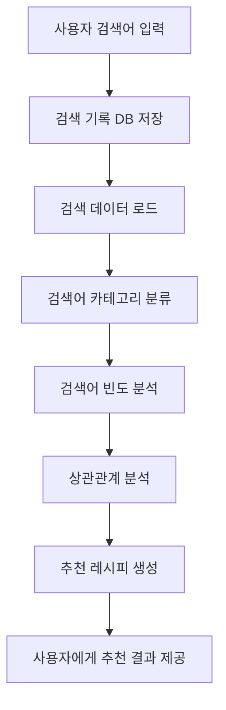

# Recommend.py 설계 문서  

> (AI 기반 음식 레시피 추천 시스템)

---

## 1. 개요 (Overview)

`Recommend.py` 모듈은 사용자의 **검색 기록 데이터를 기반으로 레시피를 추천하는 시스템**이다.  

사용자가 챗봇 또는 검색 시스템을 통해 입력한 **검색어 데이터를 데이터베이스(recipes.db)에 저장**하고,  
이 데이터를 분석하여 **사용자가 선호할 가능성이 높은 음식 레시피를 추천**한다.

추천 과정은 다음과 같이 이루어진다.

- 사용자의 검색 기록 수집
- 검색어 기반 카테고리 분류
- 검색어 간 상관관계 분석
- 사용자 선호 음식 패턴 분석
- 최종 레시피 추천

이 시스템은 단순한 검색이 아닌 **사용자의 행동 데이터를 기반으로 한 개인화 추천 시스템**을 목표로 한다.

---

## 2. 역할 (Role)

Recommend.py 모듈은 다음과 같은 역할을 수행한다.

- 사용자의 **검색 기록을 데이터베이스에 저장**
- 검색어를 기반으로 **음식 카테고리 분류**
- 가장 많이 검색된 음식 및 카테고리 분석
- 검색어 간 **상관관계 분석**
- 분석 결과를 기반으로 **레시피 추천 생성**

---

## 3. 사용 기술 (Technology)

| 라이브러리 | 역할 |
| --- | --- |
| scikit-learn | 추천 모델 학습 및 데이터 분석 |
| pandas | 데이터 처리 및 데이터 분석 |

---

## 4. 데이터 흐름 (Flow)

## 5. 전체 동작 흐름 (Pipeline)

### 설명

1. 사용자가 챗봇 또는 검색 시스템을 통해 검색어를 입력한다.
2. 입력된 검색어는 데이터베이스(DB)에 저장된다.
3. 저장된 검색 데이터를 로드하여 분석을 시작한다.
4. 검색어를 음식 카테고리별로 분류한다.
5. 검색어 빈도를 분석하여 사용자가 자주 찾는 음식 유형을 파악한다.
6. 검색어 간 상관관계를 분석하여 관련 음식 패턴을 도출한다.
7. 분석 결과를 기반으로 사용자에게 추천 레시피를 생성한다.

---

## 6. 설계 의도 (Why this design?)

기존의 레시피 검색 시스템은 단순히 **검색어와 일치하는 결과만 제공하는 방식**이 대부분이다.  
하지만 이러한 방식은 사용자의 **선호도나 검색 패턴을 반영하지 못하는 한계**가 있다.

따라서 Recommend.py 모듈은 **사용자의 검색 기록 데이터를 활용하여 음식 선호 패턴을 분석하고 맞춤형 추천을 제공하는 구조**로 설계되었다.

핵심 설계 방향은 다음과 같다.

- 사용자의 **검색 행동 데이터 기반 추천**
- 음식 카테고리 분석을 통한 **선호 음식 파악**
- 검색어 간 **상관관계 분석**
- 개인화된 레시피 추천 제공

이러한 구조를 통해 단순 검색 시스템이 아니라 **사용자의 취향을 학습하는 추천 시스템**을 구축하는 것을 목표로 한다.

---

## 7. 한 줄 정리 (Summary)

> Recommend.py는 사용자의 검색 기록 데이터를 분석하여 음식 선호 패턴을 파악하고, 이를 기반으로 맞춤형 레시피를 추천하는 AI 기반 추천 시스템 모듈이다.
